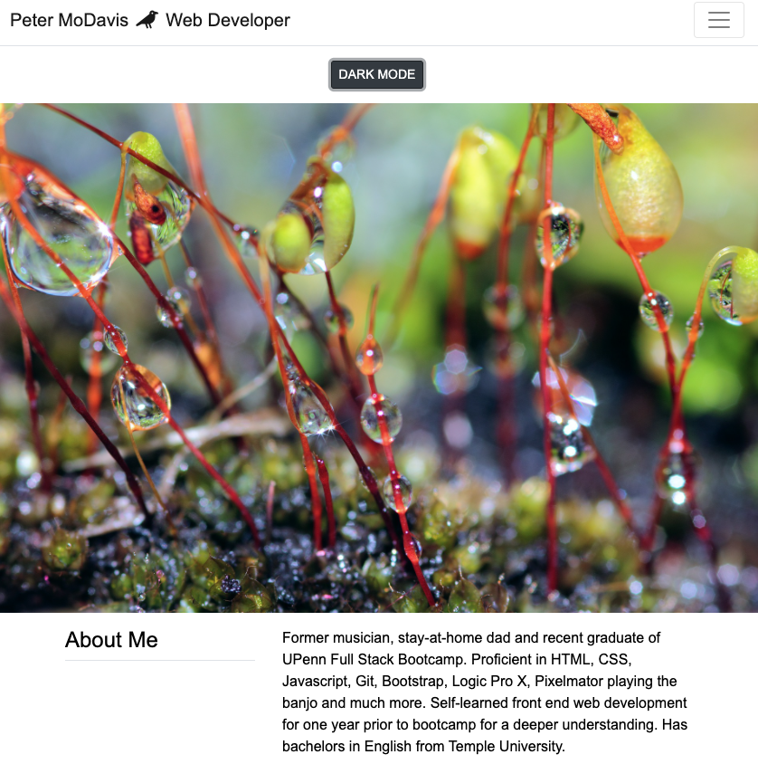
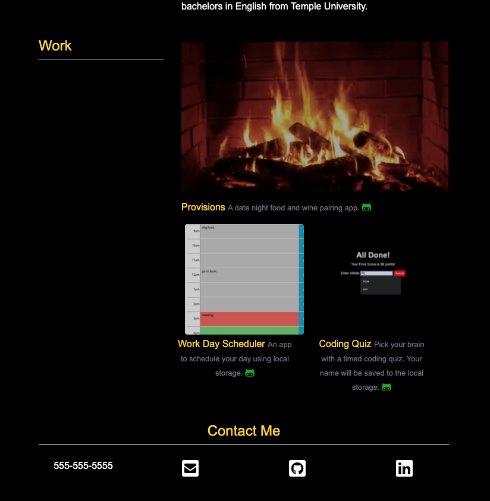

# Portfolio 2

## Description

I redid my portfolio with more knowledge under my belt and with a little help from Bootstrap it's a little more mobile friendly. I think it looks cleaner and more professional than my first one. I even added a dark mode just for kicks.

You can visit the app [HERE](https://petermodavis.github.io/portfolio-2/)

## Technology

JS, HTML5, CSS, jQuery, Bootstrap and Font Awesome.

## Usage

Just go the link provided above and look around.

light mode:

dark mode:

## Contact

pmodavis.webdev@gmail.com

## License

Copyright 2021 Peter MoDavis

Permission is hereby granted, free of charge, to any person obtaining a copy of this software and associated documentation files (the "Software"), to deal in the Software without restriction, including without limitation the rights to use, copy, modify, merge, publish, distribute, sublicense, and/or sell copies of the Software, and to permit persons to whom the Software is furnished to do so, subject to the following conditions:

The above copyright notice and this permission notice shall be included in all copies or substantial portions of the Software.

THE SOFTWARE IS PROVIDED "AS IS", WITHOUT WARRANTY OF ANY KIND, EXPRESS OR IMPLIED, INCLUDING BUT NOT LIMITED TO THE WARRANTIES OF MERCHANTABILITY, FITNESS FOR A PARTICULAR PURPOSE AND NONINFRINGEMENT. IN NO EVENT SHALL THE AUTHORS OR COPYRIGHT HOLDERS BE LIABLE FOR ANY CLAIM, DAMAGES OR OTHER LIABILITY, WHETHER IN AN ACTION OF CONTRACT, TORT OR OTHERWISE, ARISING FROM, OUT OF OR IN CONNECTION WITH THE SOFTWARE OR THE USE OR OTHER DEALINGS IN THE SOFTWARE.

## Badges

